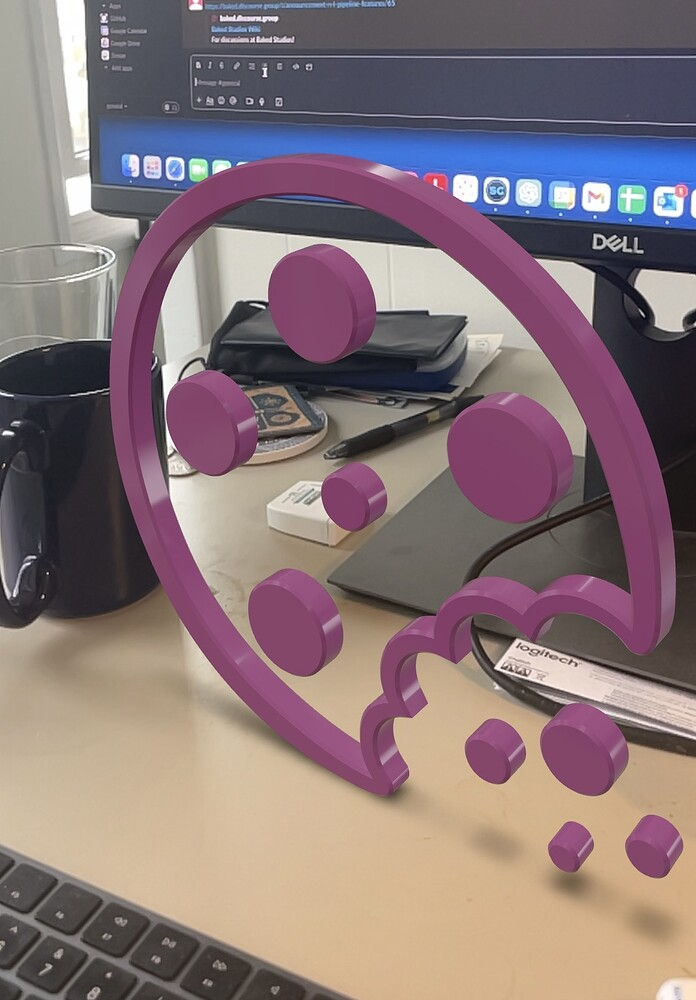

Simple and fun way to access decades worth of techno dev from Apple and Pixar:

<!--truncate-->

Export a model or animation out of Maya with the USD plugin! Can drag and drop into Apple’s “Reality Converter” if you’d like to tweak. And that’s it, you should have a file that’s openable in AR.

Happy long weekend 👍🏼

