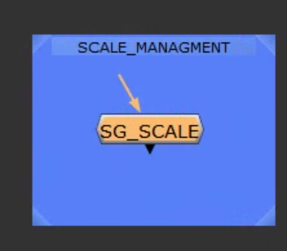
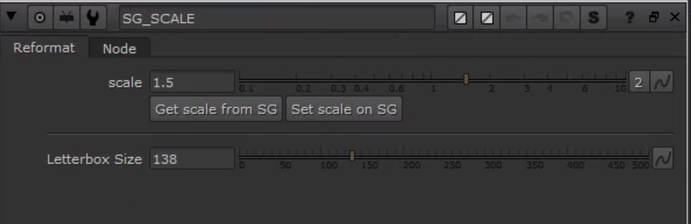
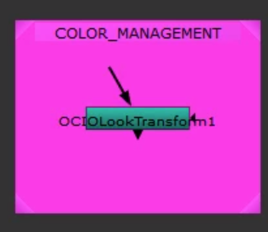
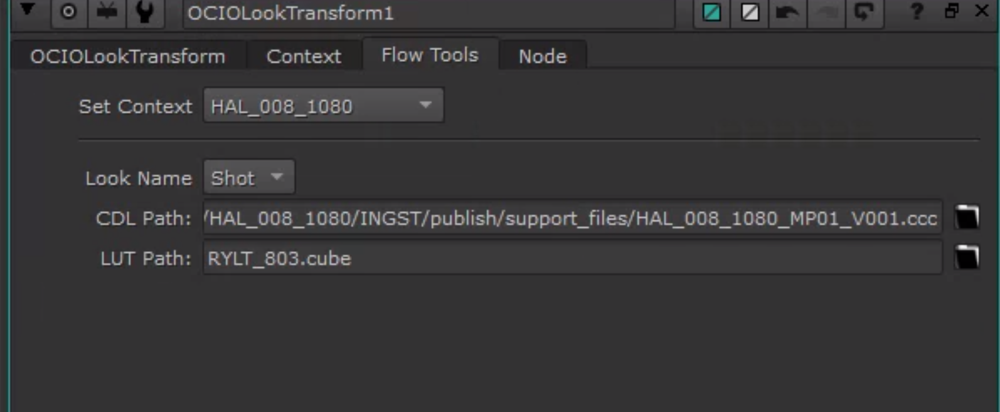

## New Nodes Added for Nuke Template

Hi guys, I've added a couple things to the [template.nk](suite://files/Film/HAL/global/configs/nuke/template.nk) that should hopefully help with color and scale.

## Scale SG Node

Please use this in your comps in tandem with your tranform to match ref. Once matched, you can send the info to SG and turn the node off for rendering. Hopefully we get positive news from the client today, and they provide us with some numbers, in which case you can use the Set scale FROM SG feature.

## Color Context Node

This is different from the OCIO Display Transform node that you can use to preview your context's display look. Here you should select your current context, or another context if you wish to preview, and check to see the LUT and CDL paths.

It will apply them to your tree. Previewing like this is helpful so you can call things out or just be aware of your color workflow manually, so it doesn't feel like guesswork.

Hopefully these additions will help with what has been a complicated workflow. Good luck over the next couple weeks!
