# Asset Workflow

> This article explains how to Add Assets to Flow Production Tracking, break them down into tasks, Open them, Build the Enclosed Maya Folders and Publish. This is different from the [shot workflow](/docs/artist/shot_workflow).

## Asset Lifecycle

Create in Flow Production Tracking -> Break down into Tasks -> Open and work on -> Publish as Scene, Baked Format (abc, fbx, usd), and Playblast -> Open in next Task/Step (if necessary), repeat steps Open and Publish -> Open up CG Shot Task -> Import Asset -> Create scene -> Publish as Scene and Render (will create .mov).

##  Adding the Asset to Flow Production Tracking

#### 1. Navigate to the page for your project in Flow Production Tracking and click the Assets tab:

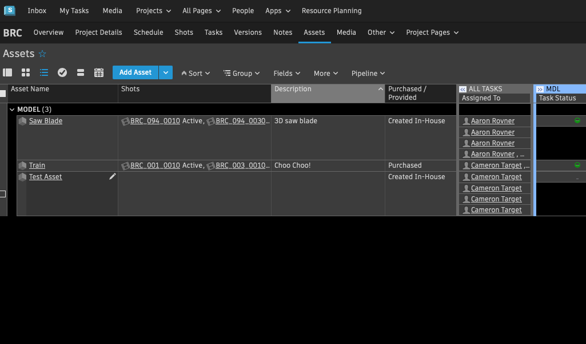

#### 2. Select Add Asset

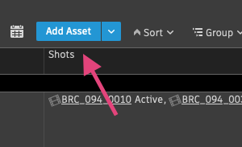

#### 3. Create the asset and fill out the fields:

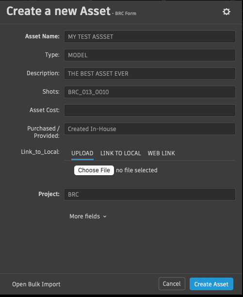

#### 4. Right click the asset that in the grid and select Apply Task Template.

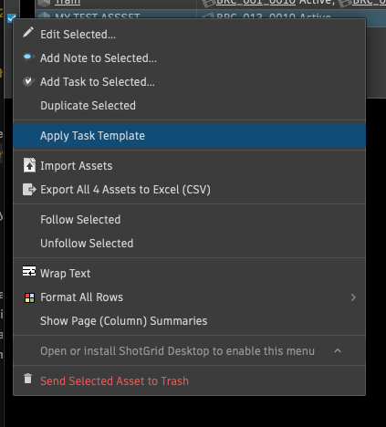

#### 5. Add a set of tasks to your Asset which you can breakdown yourself and assign to you or whoever you might need help from.

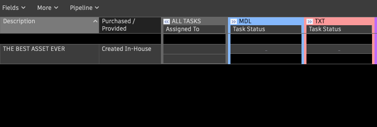

## Opening The Asset

Once you've assigned your tasks, they will be visible in the Pipeline Toolkit Workfiles app (File Open) and you'll be able to work within a context oriented folder structure generated by Flow Production Tracking.

#### 1. Launch Maya from the Flow Production Tracking Desktop app and navigate to 'File Open' in Maya

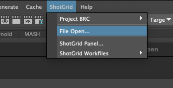

#### 2. Open the asset you created on Flow Production Tracking and assigned based on the step in the process (task) you want to work on.

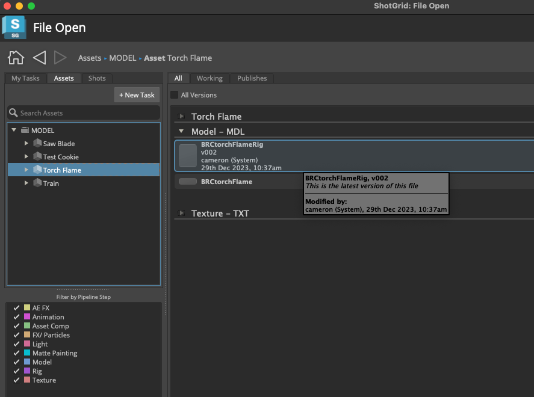

## Building the Usual Maya Folders

With your file open in the correct context, you can now build your Maya folder structure.

#### 1. Open the Project Window by going to File -> Project Window

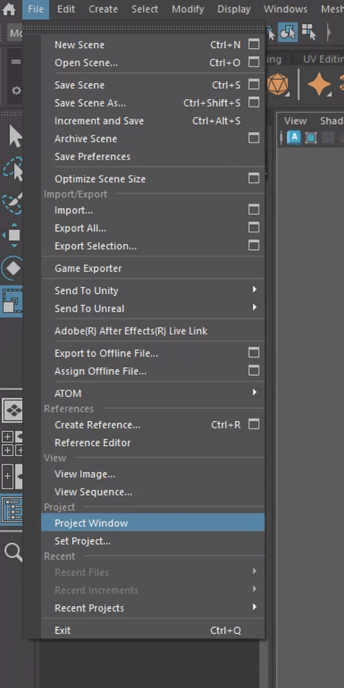

#### 2. Finalize the folder structure you want within this Maya Project

:::note

Some of these locations will be overridden (not overwritten) by the TEMPLATE.yml file in our Config.

:::

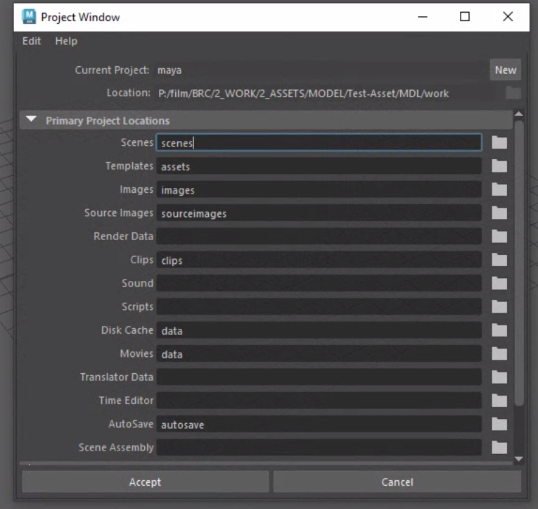

#### 3. You can check your folder structure to make sure your Maya Project sits nicely in the right context.

:::note

Since you are still working in the relative file path and all your Maya files are in the right place, any scenes, caches, playblasts and renders will still end up where they need to be.

:::

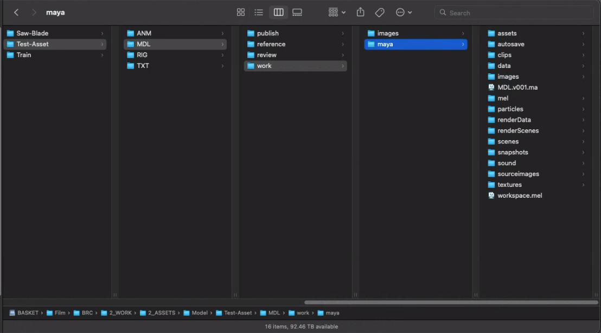

## Publishing from Maya

### Scenes

#### 1. Save your Scene:

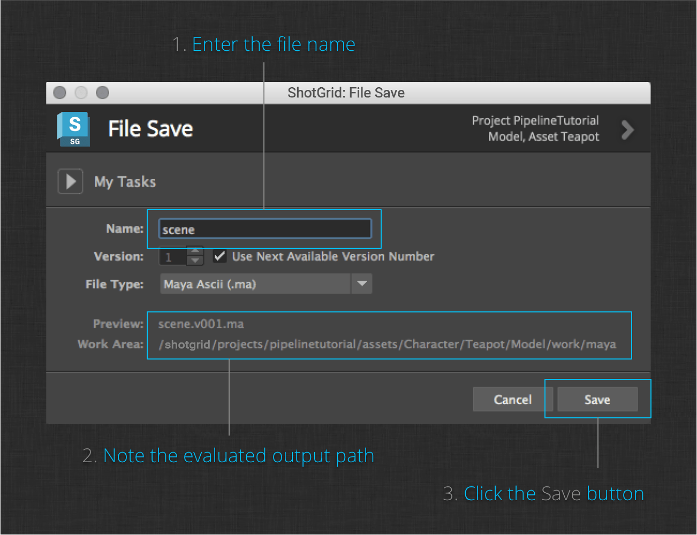

#### 2. Publish your Scene:

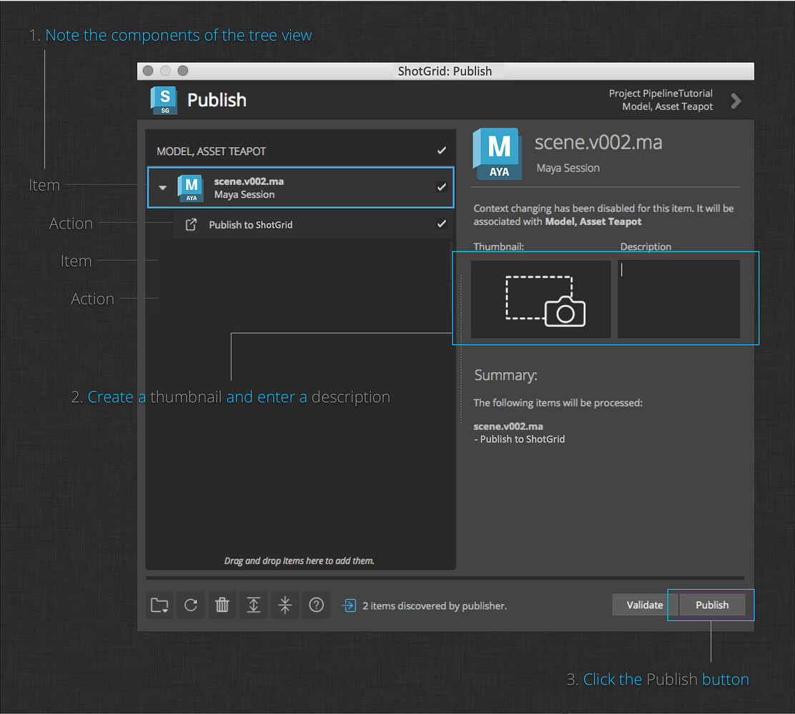

### Alembics

#### 1. Finish your geometry.

#### 2. Save your scene.

#### 3. Publish your geometry:

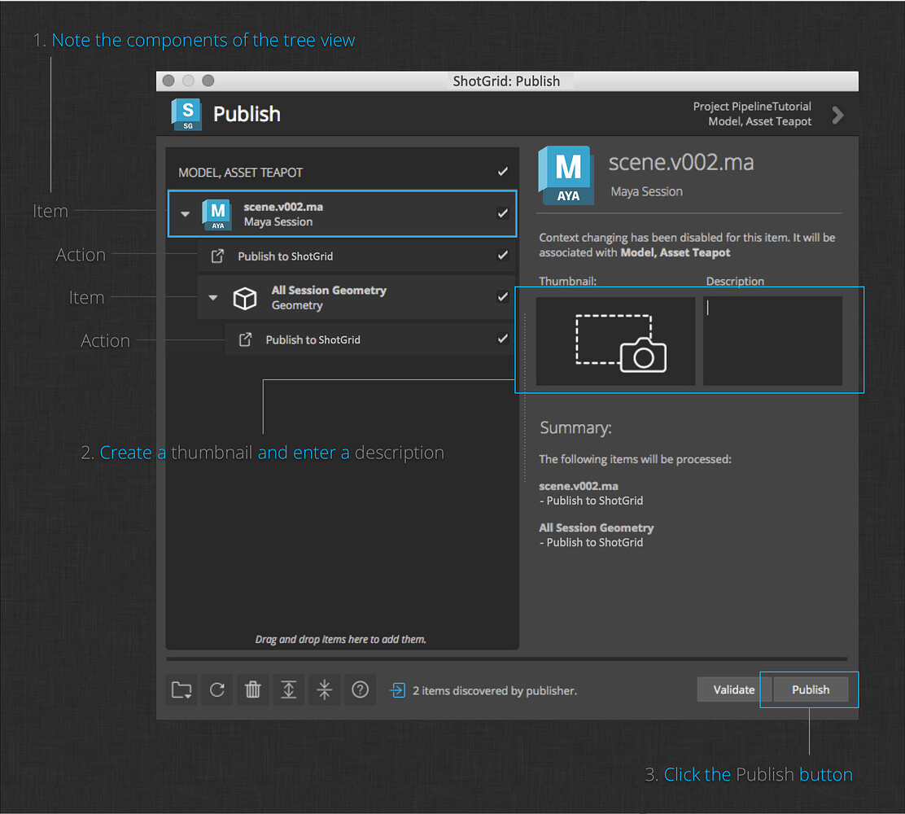

### Playblasts

#### 1. Create a playblast.

#### 2. Publish your playblast.

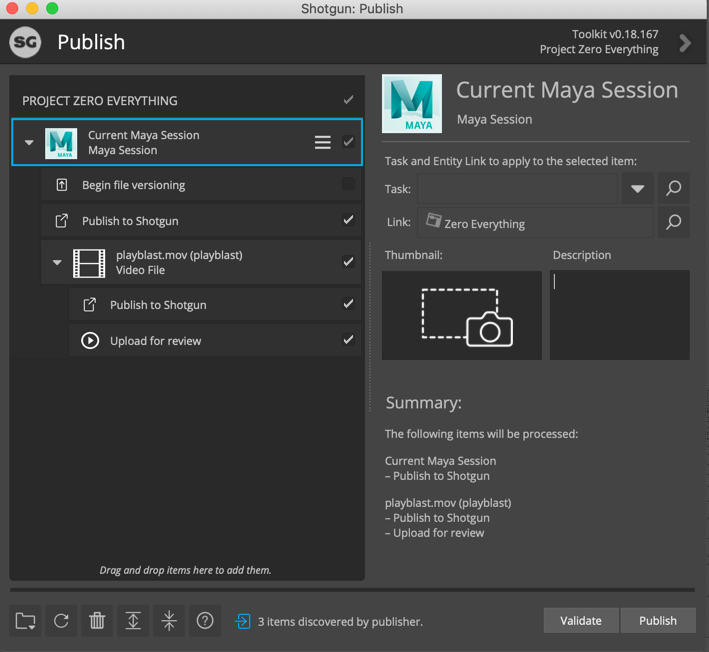

### Renders

#### 1. Render your shot to disk.

#### 2. Publish your render to Flow Production Tracking.

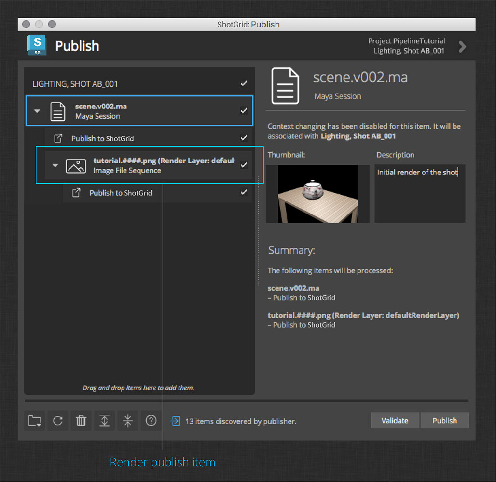
