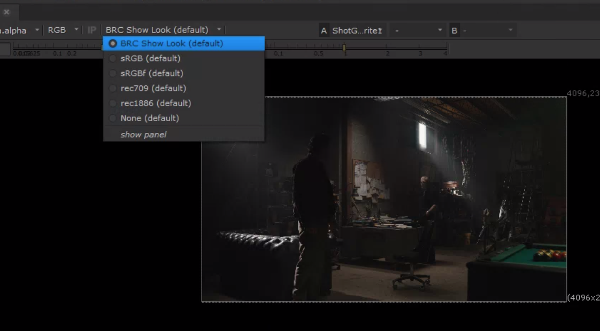
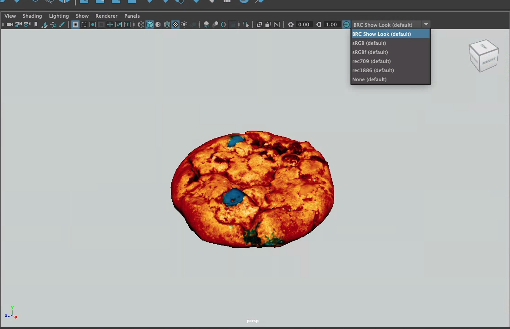

# OCIO Color Workflow

> The Pipeline Toolkit tools from Nodes & Layers have built in support for OCIO and context switching. This means that switching between shots will automatically change the OCIO environment and provide LUTs and CDL’s for the current shot.

## The Configuration
By default, when starting up a project in Flow Production Tracking, our config looks for a file at the following location:

`[project_root]/global/configs/ocio/config.ocio`

:::info
To learn more about OCIO and how to create configuration files, please visit the [OpenColorIO website](https://opencolorio.org/).
:::

## Nuke

#### 1. Open Nuke through Flow Production Tracking and open a file associated with a shot from the Flow Production Tracking -> File Open window.

#### 2. Select your Show Look or Shot Look from the Viewer Process dropdown

:::tip
Make sure you don't have color info applied manually when you go to render your scene! This is all managed by Export Profiles.
:::

## Maya

#### 1. Open Maya through Flow Production Tracking and open a file associated with a Shot or Asset from the Flow Production Tracking → File Open window.

#### 2. Select your Show Look or Shot Look from the Viewer Transform dropdown

:::note
Troubleshooting: If for any reason either drop down doesn't appear correctly, then either the shot support files haven't been published correctly, or the OCIO config is missing something. Please reach out to the supervisor or coordinator on your show.
:::
