# Shot Workflow

>This article outlines the shot workflow for Nuke and Maya. This is different from the [asset workflow](/docs/artist/asset_workflow).

## Nuke
#### 1. Load SG Desktop

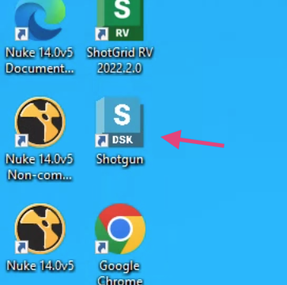

#### 2. Click your project

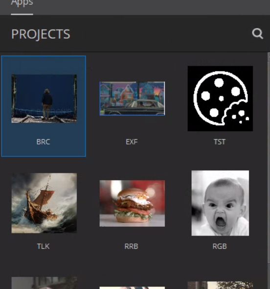

#### 3. Click your program

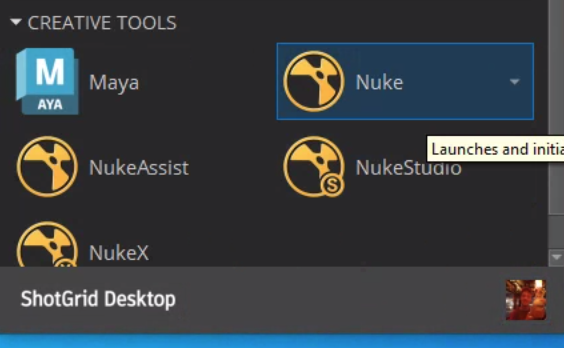

#### 4. Go to Shotgrid - File Open

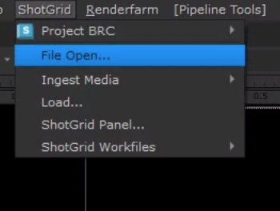

#### 5. Find your File and Open or create a new

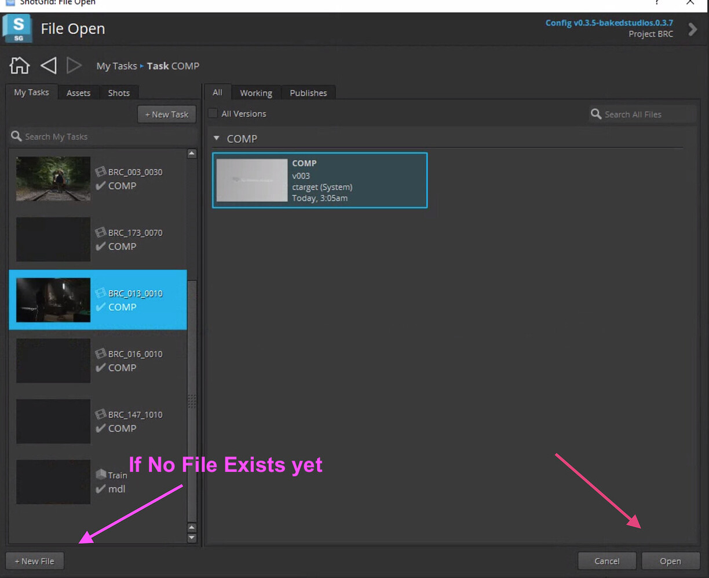

#### 6. Go to Shotgrid -> Loader to Load Your Media/Plates/Assets

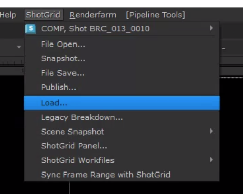

:::note
You can now begin work and continue when ready.
:::

#### 7. Create a Shotgrid Write Node

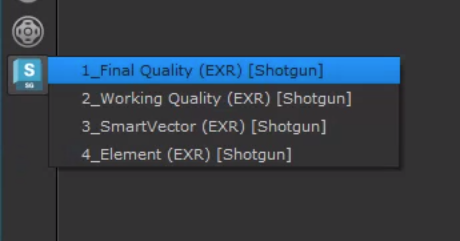

#### 8. Select Write Node and Submit Nuke To Deadline

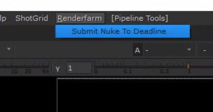

#### 9. Wait for Render

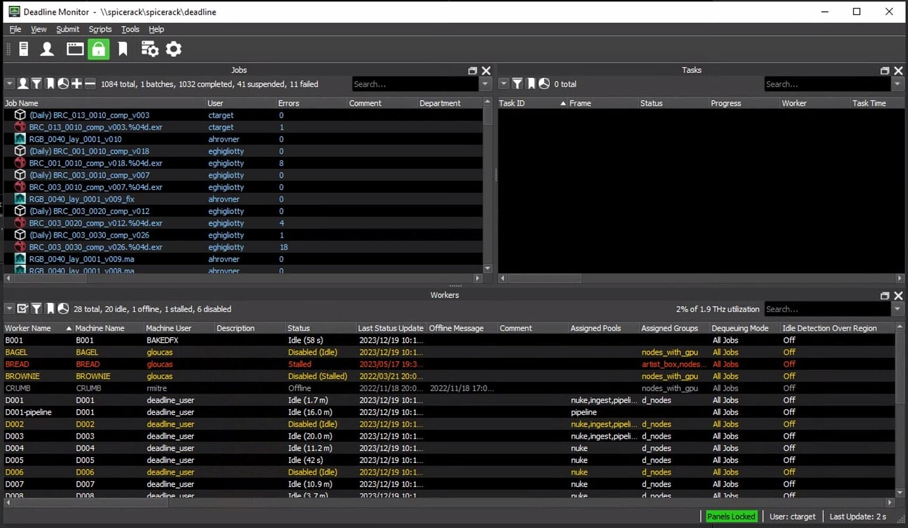

#### 10. Select Write Node and Read from Write

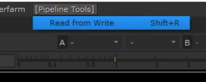

#### 11. Select Read Node and go to Shotgrid -> Publish

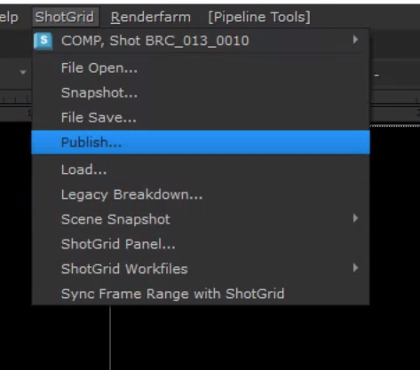

#### 12. Enter description and publish.

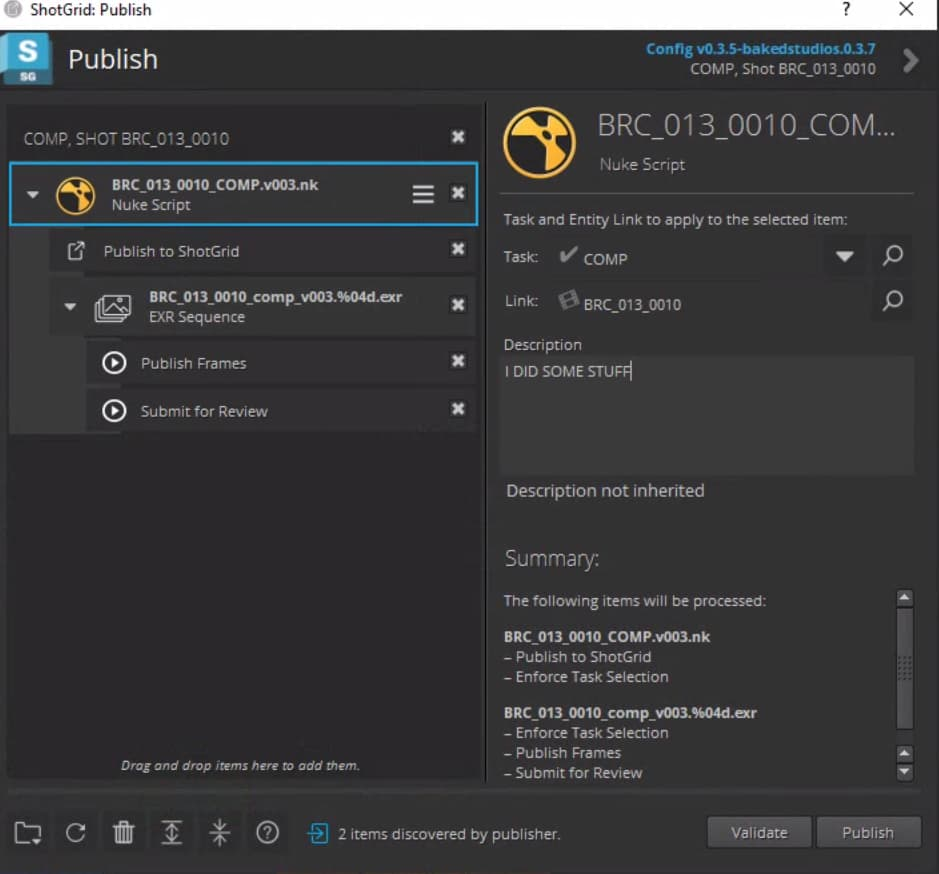

#### 13. Wait for render

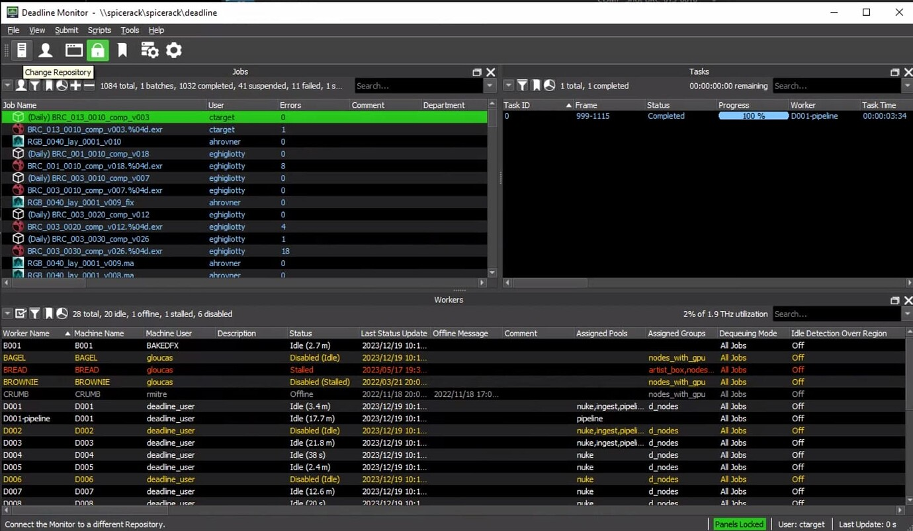

#### DONE!

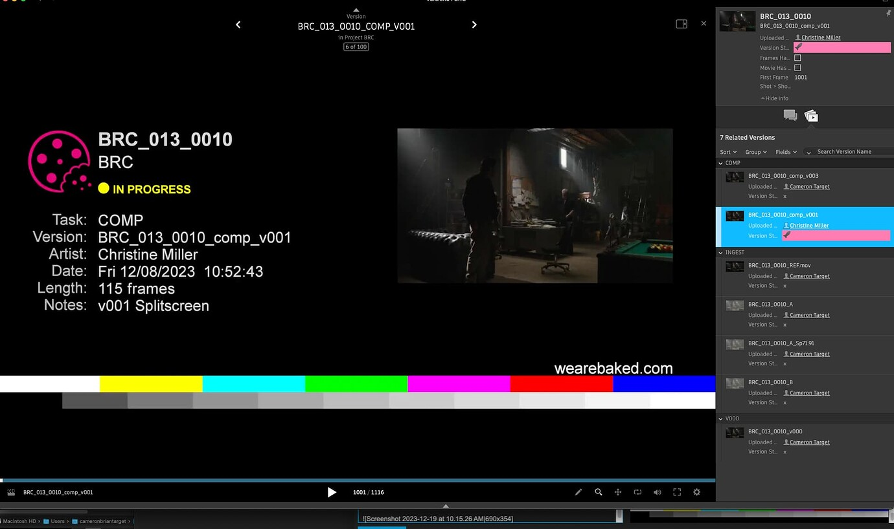

## Maya

#### 1. Load SG Desktop

#### 2. Click your project

#### 3. Click your program

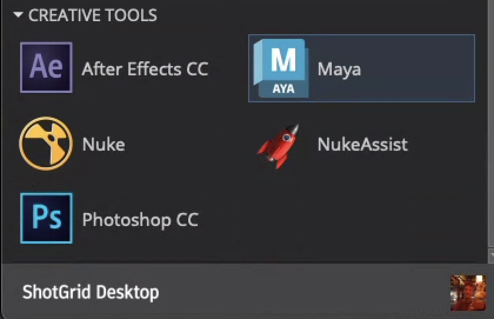

#### 4. Go to Shotgrid - File Open

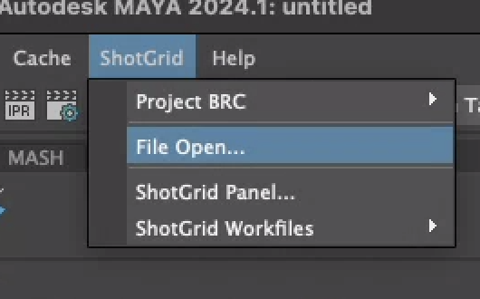

#### 5. Find your File and Open or create a new

#### 6. Go to Shotgrid -> Loader to Load Your Media/Plates/Assets

:::note
You can now begin work and continue when ready.
:::

## Publishing in Maya
### Scenes

#### 1. Save your Scene:

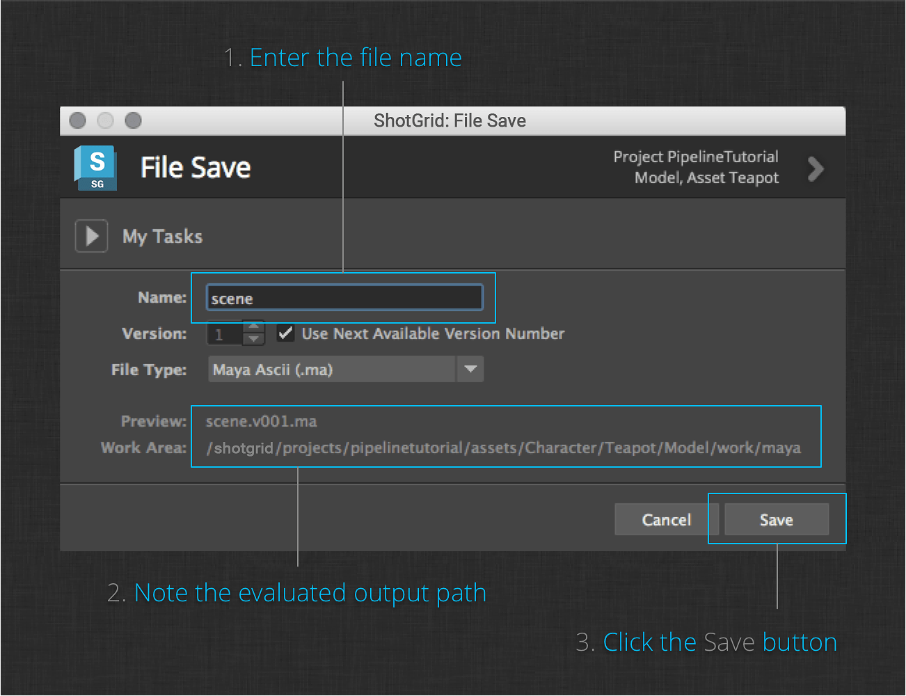

#### 2. Publish your Scene:

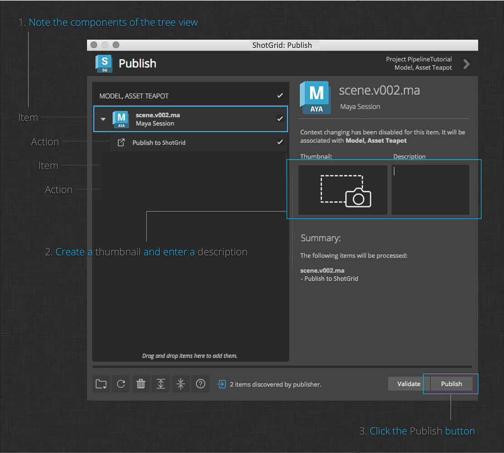

### Alembics

#### 1. Finish your geometry.

#### 2. Save your scene.

#### 3. Publish your geometry:

### Playblasts

#### 1. Create a playblast.

#### 2. Publish your playblast.

### Renders

#### 1. Render your shot to disk.

#### 2. Publish your render to Shotgrid.

