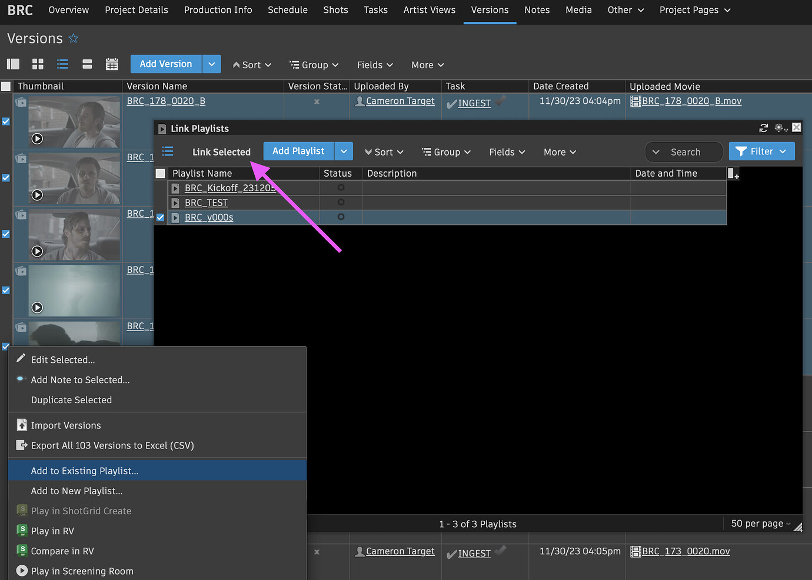
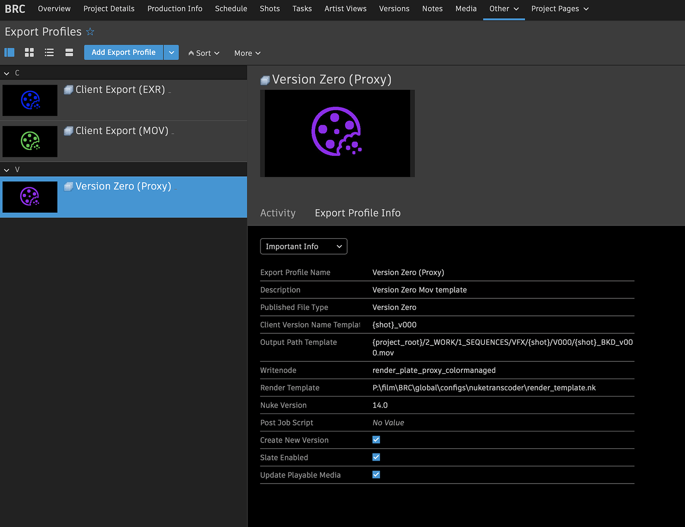
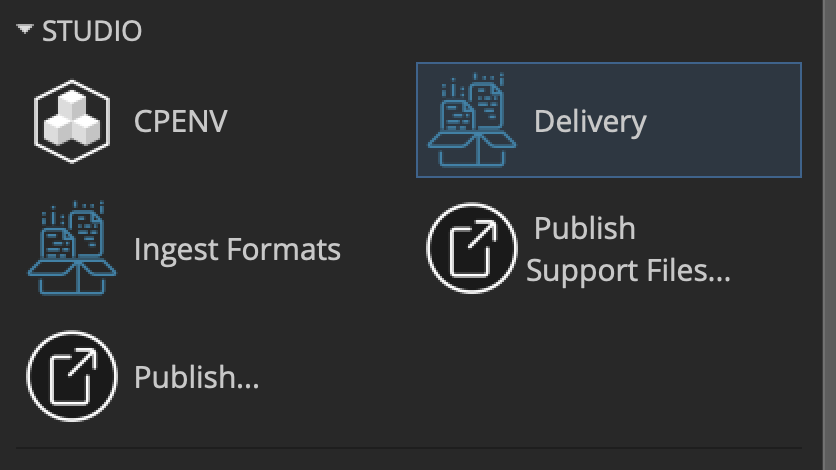
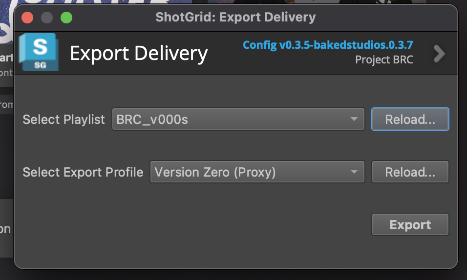

# Export

>The following is an example of the process for exporting v000s from Plate versions. The same process can be applied for other export profiles like Client Mov and Client EXR.

## Creating A Playlist

This is the first step in the export process. You want to select the versions that you want exported. In this case I'm linking them to a playlist called BRC_v000s but if you were exporting client versions, you'd select from the Client Movs tab and add to a playlist that you would name for the delivery you're sending e.g BRC_BKD_VFX_Submission_231218

## Understanding Export Profiles

Now that you have your playlist set up, I want to touch briefly on export profiles because they're important to understand. Below is the "Export Profile" for V000s. This shows a few settings that can be changed on a project to project basis, or on the fly if you have something specific you need to do.

Let's zoom in a big and look and some of the details that can be edited:

|Field Name | Description|
|--- | ---|
|Export Profile Name and Description | Exactly what it sounds like!|
|Published File Type | This is important to specify for publishing in Flow. It tells Flow what to look for e.g a file path, a movie, a v000 etc...|
|Client Version Name Template | This is the name that will be given to the version created in Flow.|
|Output Path Template | This is where the output media will end up. So regardless of where it comes from it will be here. We use various tokens to specify a path that's relative to the shot for things like V000s, but for something like client versions, this is handy because we can put everything in a specified delivery folder which takes the media out of their various specific file paths, and puts them on a surface level that's easily accessible.|
|Write Node | This is which node in the render_template.nk script to use for the render. The Nuke Transcoder picks up this node and writes according to everything linked to that write node, so for a v000 there might be color workflow stuff, but for client EXRs there might just be a passthrough to the write node that renders with PIZ compression.|
|Render Template | This is just to tell the Export Profile where to find the above nuke script that contains the write node. This will often be in the folder structure for that project, but may also be kept in the Admin folder in the root directory of Basket.|
|Create New Version [Check Box] | Check this if you want the export profile to create a new version in Flow. You'd want this for v000s but not for client versions.|
|Insert Slate [Check Box] | Check this if you want the media to be slated. Basically everything except Client EXRs.|

## Using the Delivery Tool

In Flow Desktop, navigate to Studio: Delivery Tool - you'll get a pop up with your playlist options and deliver export profile options.

If you've made any changes to either the Playlist or Export Profile, you can reload them live from this stage in the process if you choose.

## Waiting on Deadline

The tool then sends your playlist to Deadline to be processed. Deadline will pull from the path to frames field in each of the versions you submitted in your playlist to create new versions using the node specified in the export profile. Those versions will be put in the folder structure according to the Output path template and uploaded to Flow if the "Create New Version" checkbox was enabled on the Export Profile.

This is an added time-suck in our pipeline. Coords will have to wait for deliveries of all kinds to render before delivery. Overall, it's a faster process for the big picture, but for whoever has been assigned this step in the process, it might be slower than what we're used to doing.

:::info
You can read more about the Delivery tool in the Nodes & Layers official documentation.
:::
