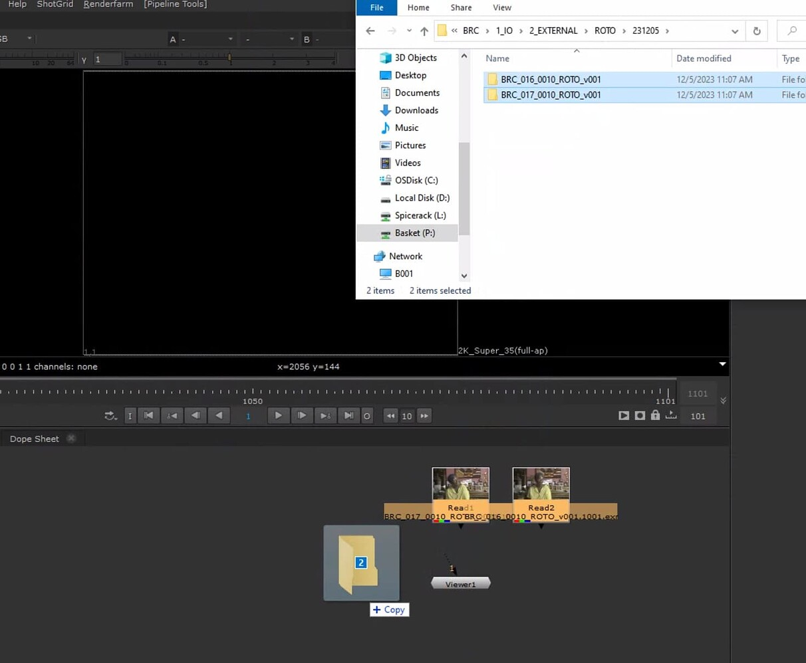
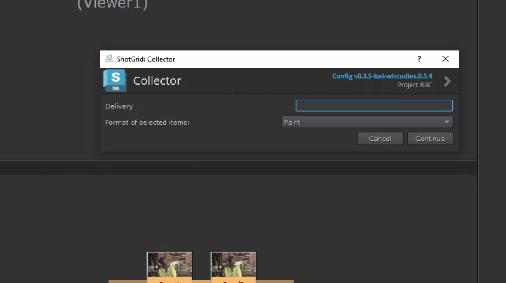
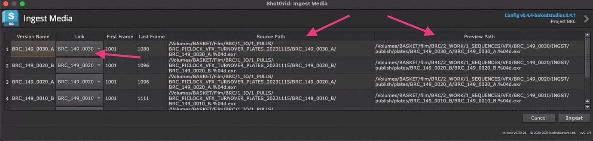
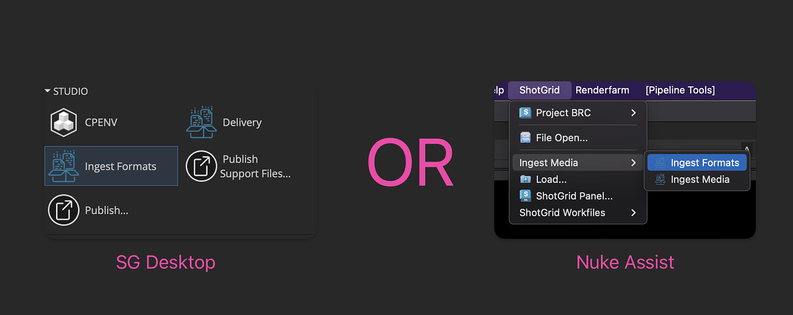
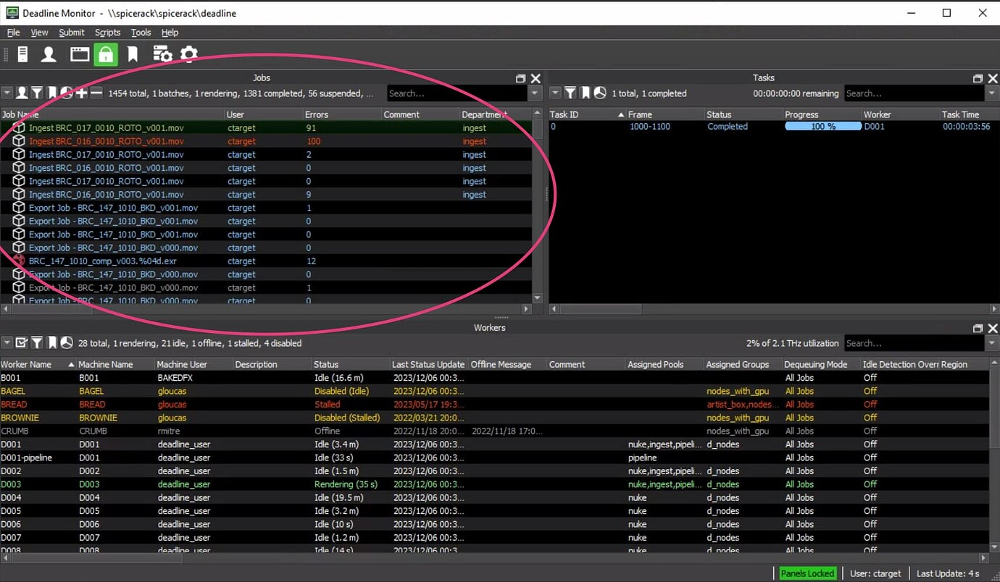
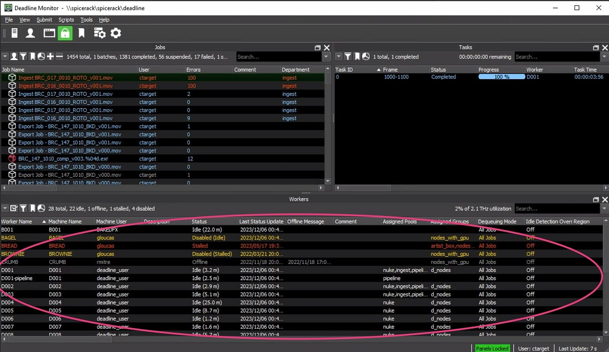

# Ingest

> The Ingest Tool is an application developed for the Flow Production Tracking Pipeline Toolkit which utilizes Nuke Assist and python to transcode and organize media in order to bring it into our pipeline in a uniform, efficient way.

## General Steps

1. Sort your media in your file browser.

2. Open the Flow Production Tracking Desktop app

3. Open Project

4. Launch Nuke Assist

5. Drag and drop folders into the [node graph](https://learn.foundry.com/nuke/content/getting_started/using_interface/navigating_node_graph.html)

6. You can sort media in the "Node Graph" by selecting all and pressing "L" on your keyboard.

:::warning
You can drag and drop a maximum of 32 plates at a time.
:::

7. Select all the media and go up to the drop down menu called "Flow Production Tracking" and click Ingest Media.

8. You'll get to the below collector where you need to enter your Delivery Name (this can be the Package name) and then select the [Ingest Format](/docs/coordinator/ingest/#ingest-formats) you'd like to ingest with.

9. Click continue and you'll see this window below which shows you all the matches the ingest tool was able to make - as well as the Source path and Output Path Preview.

10. Click Ingest and your the job will be published, and either copied/moved or sent to Deadline to be transcoded and uploaded to Flow Production Tracking if applicable - depending on the ingest format specified.

## Ingest Formats

Here's a quick explanation of the ingest formats:

| **Format**                       | **Description**             | **Slate**                                                                  |
|----------------------------------|-----------------------------|----------------------------------------------------------------------------------------------------------------------|
| Plate              | Puts the plate where it should be and transcodes it.              |None                                                                                                             |
| Plate Proxy        | Takes the plate and turns it into a movie for SG.                 | Yes - Orange "Plate"                                                                                                      |
| REF       | Generates an SG version of the REF with a Baked Slate, also puts the ref in the right folder.         | Yes - Blue "REF"                                                                                                     |
| Roto             | Similar to 'Plate' - takes Roto from IO folder, but just copies it to the correct folder. No transcoding.  | None                                                                                                  |
| Roto Proxy        | Just like Plate Proxy, creates a movie for SG        |  Yes - Red "Roto/Paint"                                                                                  |
| Paint             | Similar to 'Plate' - takes Paint from IO folder, but just copies it to the correct folder. No transcoding.              | None                                                                                              |
| Paint Proxy       | Takes Paint work and turns it into a movie for SG.                | Yes - Red "Roto/Paint"                                                                                             |
| Version (External)              | Ingests versions from external partners. Sorts renders into respective COMP task.               | None                                                                                            |
| Version Proxy (External)   | Creates a movie from external version for SG.           | Yes - Yellow "In Progress"                                                                                      |

:::note
The slated formats are generated by rendering with the color workflow except for the Plate (we want the raw) and REF (don't want double color).
:::

## Understanding Deadline

Deadline is the way we manage our render farm. Imagine a bunch of mini computers that do work for us. Deadline is the Flow Production Tracking of these "nodes". You don't need to become a deadline expert but here are the things that will help.

### The Jobs List

This just shows you what's coming up. You'll want to see that your jobs are being added after you hit INGEST in the ingest tool.

:::tip
**Checking for errors:** If you right click a job and click "View Job Reports" you'll see a list of logs from the job. This will include any errors the job encountered. You can drag the column open a bit or double click to view info about the error.
:::

### The Task Monitor

This actually shows you what is being down within the job. So what frame range is being rendered, by what computer and where it's at in the progress. You'll want to wait until all these are 100% before you start verifying your media made it out the other end.

### The Worker Monitor

This you can largely ignore... It just shows you which computers are up and running, and how they're holding up. For ingest, we're assigned D001-D003 only, so if you see any others lighting up bright green, let me know!

:::tip
You can right click a job at any point and select `Job Output` to view what you're making in the folder structure.
:::
