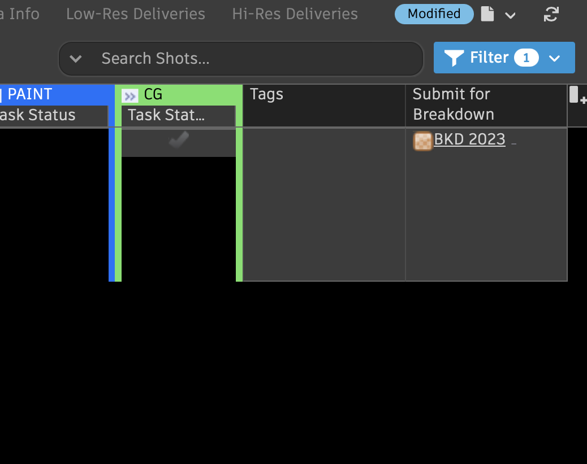
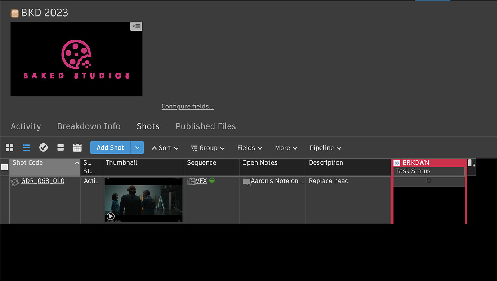
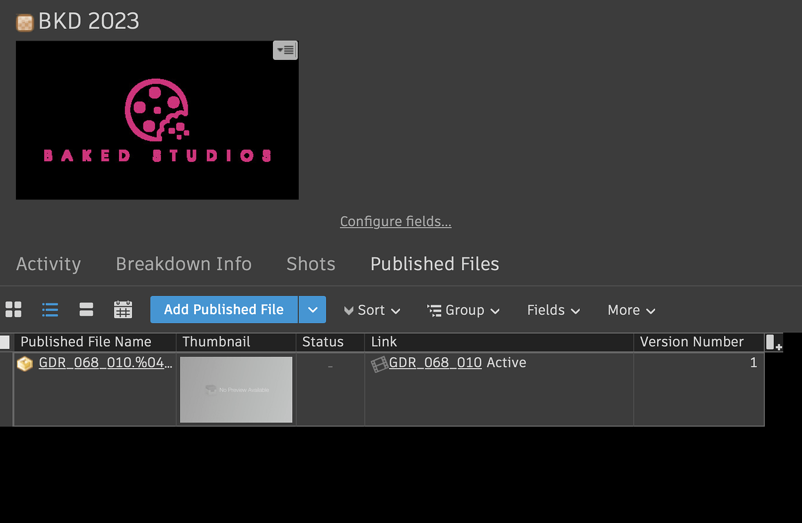
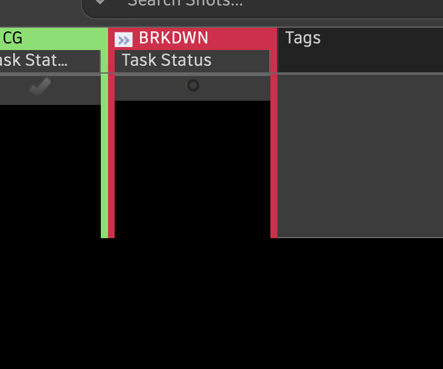

# Submit for Breakdown

>Approaching breakdowns in this way allows for the pairing of published files with shots assigned as breakdown shots - so someone else down the line can be assigned the task of a breakdown.

#### 1. Add the field "Submit for Breakdown" if it's not already there on your `Shot's Page`

#### 2. Type in the breakdown year you'd like it to be a part of. E.g BKD 2023, or BKD 2024...

This will add the shot to the breakdown:

As well as the published files - which can be opened by anyone assigned to the Breakdown task:

#### 3. Add a breakdown task to your shot. Which will show up in the artist's My Tasks.

