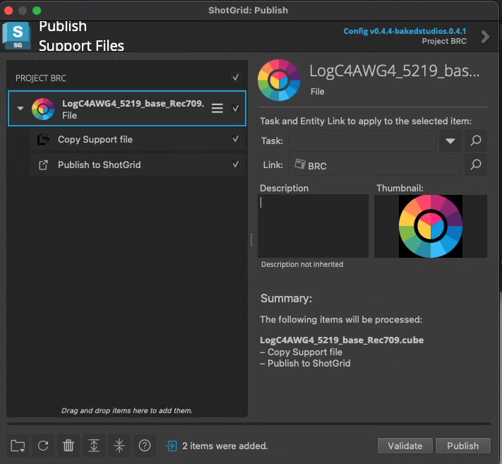
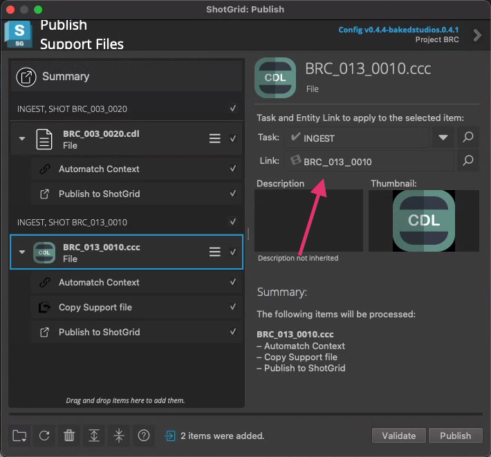

# Publishing Support Files

> This step is important for the [ocio color workflow](/baked-docs/docs/project_setup/ocio_config/). Specifically .cdl and .ccc files published here will swap out with the `$SHOT_CUBE` tag in the ocio config.

:::info
Shots that don't have a published corresponding .cdl or .ccc will default to a blank .cdl or .ccc that lives in the `global/configs/ocio` folder.
:::

1. Open Shotgrid Desktop

2. Open a Project

3. Open "Publish Support Files..."

4. In Finder, access your support files where they should live in Basket -> PRO(3 letter project code) -> 1_IO -> 1_PULLS -> PRO_COLOR

5. Drag and drop the show LUT to the Support Files Publisher

:::note
Show LUTs will not match context like .ccc and .cdl files will. Still a good idea to publish the file.
:::

6. Drag and drop all your cdls/ccc files named for the shot they belong to into the Support files Publisher. Notice the Context is Auto-matched and .ccc files are always copied to the template path - i.e they end up in the shot folder.

:::tip
You can drag and drop all the .ccc files for a show into the publisher and so long as they're named correctly, they'll link up with the shot they belong to and copy over to the right folder.
:::
