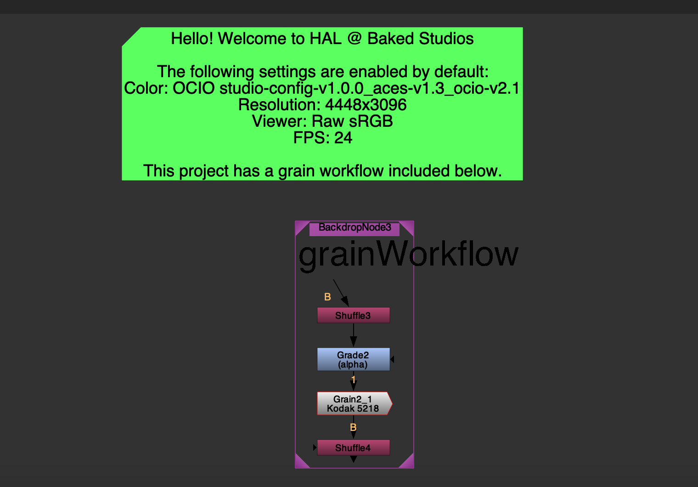

# Setting the Nuke Template

>This article explains the purpose of the template.nk file and how to change it.

## Finding the File

The template.nk file always lives in `global/configs/nuke/template.nk`. It's the default nuke script that opens when you open nuke within your project environment in Flow Produciton Tracking. When you set this, it's set for everyone on that project.

## Important Settings

The template is just a nuke script, so important things would be project settings, and putting important information information and useful nodes in the node graph.

:::tip
It's a good opportunity to set and forget your ocio config in your project color settings.
:::
