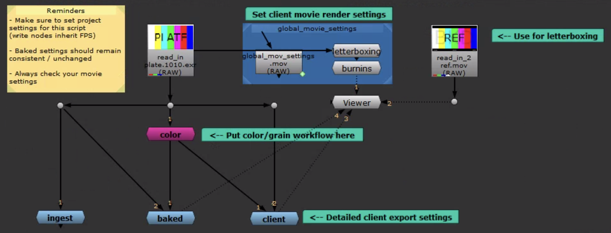
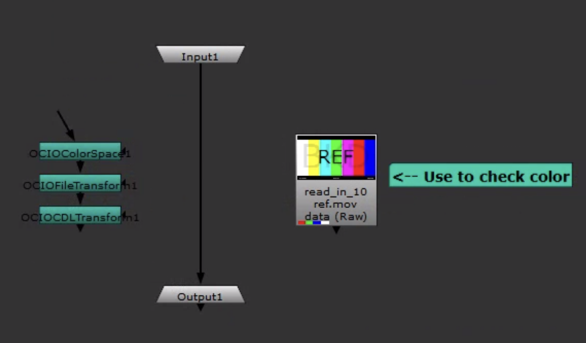
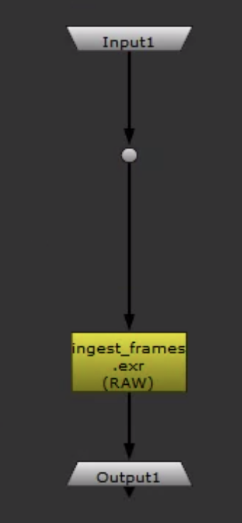
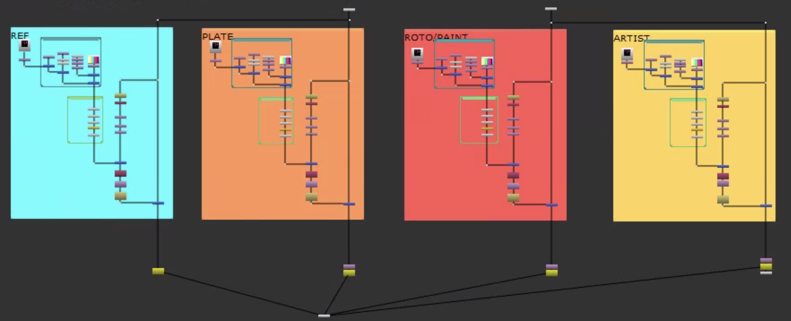
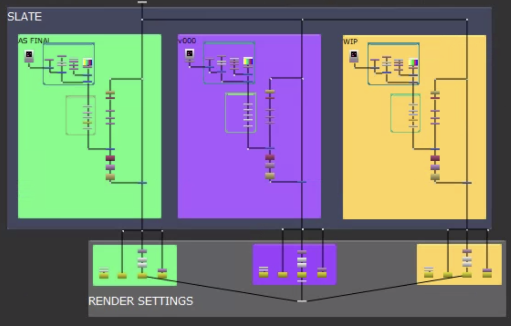
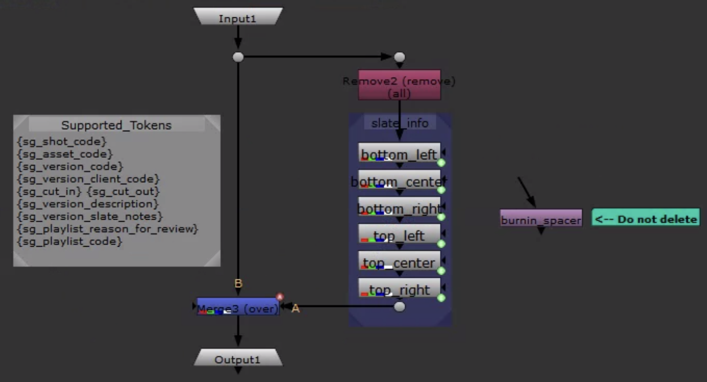
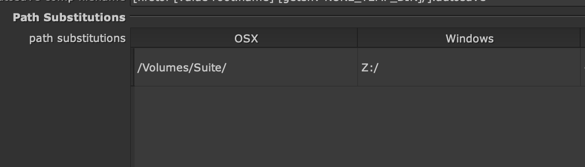

# Configuring the Nuke Transcoder Render Template

>This article explains how the Render Template works and how to configure it for a new project. The Render Template is the most important part of this workflow and needs to be set very carefully by an artist or supervisor.

## Nuke Transcoder Deadline Plugin

Generally speaking, the details of the Nuke Transcoder Deadline plugin are beyond the scope of this documentation. However, it's important to know that the plugin takes any incoming rendered sequence or movie and plugs it into the render_template.nk file. The Nuke Transcoder Deadline plugin then manages a bunch of file paths, tokens and specified render nodes within the script to produce stuff on Flow Production Tracking using their API. The plugin is pretty involved but it exposes the render_template.nk file for Artists to edit at the start of a project in an environment they feel comfortable in. In its raw form however, the render_template.nk file is an empty nuke script except for two nodes: `read_in` and `render_playable_media`.

:::tip
Node names matter, file paths matter and file location matters.
:::

## Our Baked render_template.nk File

Nodoes & Layers provided us with a blank slate to start on. All of their clients have different render_template.nk files specifically suited to their needs. In our case, it was put together by me and it's largely an evolution of the slate template our artists have been using for a while now.

:::info
The render_template.nk file can be found [here](suite://files/Admin/resources/render_template/render_template.nk) and needs to live in your `global/configs/nuketranscoder` folder for each project.
:::

Here's the root node graph:

It's pretty well labeled and anyone with a nuke background should be able to parse what's going on. Something to note however, is how the `global_movie_settings` work.

These settings funnel down to a bunch of different write nodes that go along different trees representing the different flavors which can be generated by the script. The FPS on the `global_mov_settings` node itself is linked to the Project Settings - which in turn is inherited by other movie write nodes in the script. Codec and Codec Profile are also inherited by several movie write nodes.

The letterboxing and burnin nodes are pretty straighforward and also inherited from previous iterations of render templates. These two nodes pass their settings on to nodes in the `client` group as well.

:::info
A full list of nodes is available [here](/baked-docs/docs/project_setup/nodes_list)
:::

Let's go through the groups.

### color

This is where the color workflow goes.

### ingest

This is really just a node in a group for organization. You should adjust the settings here if for some reason we need to turn off dwaa/dwab compression for working exrs and or we need to change the format for working media.

### baked

This is where the different types of media for internal baked purposes is created. These settings should mostly stay the same across projects. One question to discuss is where to force a resolution or keep same as source. Same as source is super flexible and it's my preference and it's set that way by default.

### client

These are the various client requested flavors. Green is "As Final", Purple is for v000s and Yellow is for "WIPs".

### burnins

This is where burnins can be adjusted. I recommend doing this on the root node graph in the group node under the global_movie_settings backdrop. The other burnin

## Cross-platform Compatibility

In order to ensure cross-platform compatibility, all read nodes built into the script need to start at the root Z:/ for our mounted cloud storage. MAC users can set their Nuke Preferences for Path Replacement to substitute `Z:\` for `/Volumes/Suite`

:::warning
There is a nuke bug that does not replace the path for fonts properly. We are actively working on this issue with The Foundry.
:::
