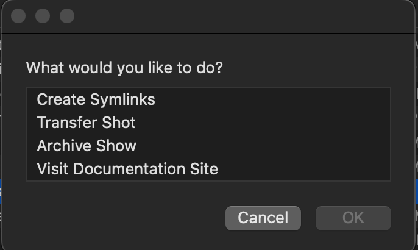

# Baked Tools App

:::info
The Baked Tools App can be downloaded [here](https://github.com/BakedStudios/baked-tools-app/archive/refs/heads/main.zip).
:::

:::note
Currently only available for MacOS.
:::


## Setting Symlinks

Setting symlinks is really easy! Open the Baked app, select the `Create Symlinks` option and then enter your project details. This will create the project folder in your root at ```{root}/{category}/{project_name}``` then create two symlinks, one pointing to Basket and one pointing to Suite. If either location is not set up, it will return a message letting you know.

:::tip
You can set up one location without the other, e.g. Suite without Basket.
:::



## Coordinator Tools

There are a couple coordinator tools available in the app as well. You can Archive a show, which runs a script to copy all the shots from Suite back to Basket. You can also transfer a shot from Basket over to Suite. This is if a shot started on the LA/Basket side, but needed to become collaborative outside of the on-premise setup.

:::tip
Transfering large amounts of data from Suite to Basket is best done with a computer that has an SSD with the project pre-cached. It's still doable otherwise, but this is just super speedy.
:::
