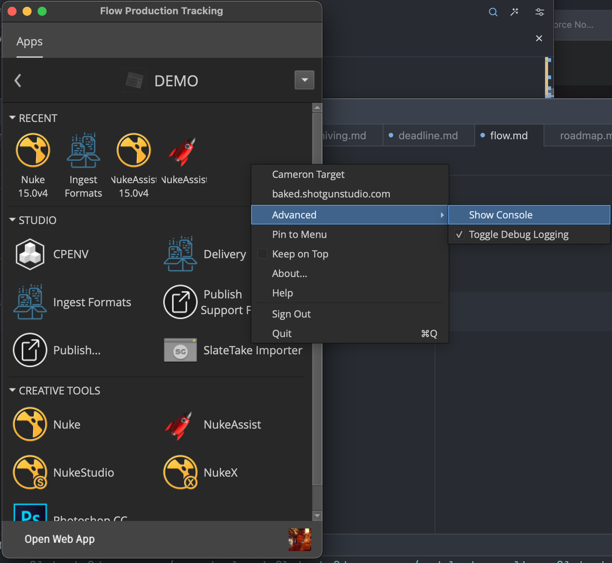

# Flow PTR Desktop

:::info
You can download the installer for Flow Production Tracking Desktop [here](https://community.shotgridsoftware.com/t/a-new-version-of-the-flow-production-tracking-desktop-has-been-released/18595/)
:::

## Installing Flow

Once installed, you'll be prompted to login to your Autodesk account that's been set up as a user for Baked's Flow Production Tracking site.

## Using Flow Desktop

Flow's Desktop app is pretty intuitive. Once logged in, you can select from a set of projects you're involved in. It's important to always launch apps from within this context or the rest of the pipeline won't work.

## Troubleshooting Flow

If you're having issues with something, or something won't open, you can always right click a blank space in the project page in Flow Desktop and select `advanced->show console`. This will give you error messages so we can see what's up.

